# MySQL Study
學習之後，製作成筆記，方便日後使用時復習
 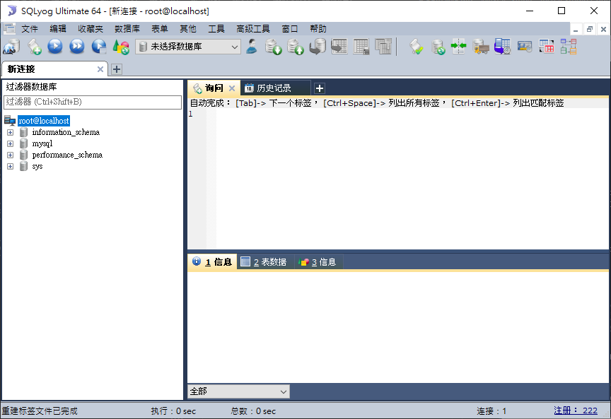

 # Linux 安裝MySQL
檢查系統上是否已經安裝
```shell
rpm -qa | grep mysql
mysqladmin --version
```

下載及安裝
```shell
wget http://repo.mysql.com/mysql-community-release-el7-5.noarch.rpm
rpm -ivh mysql-community-release-el7-5.noarch.rpm
yum update # 這邊會下載不少資料，要花點時間，中間也會詢問y or n
yum install mysql-server
```

  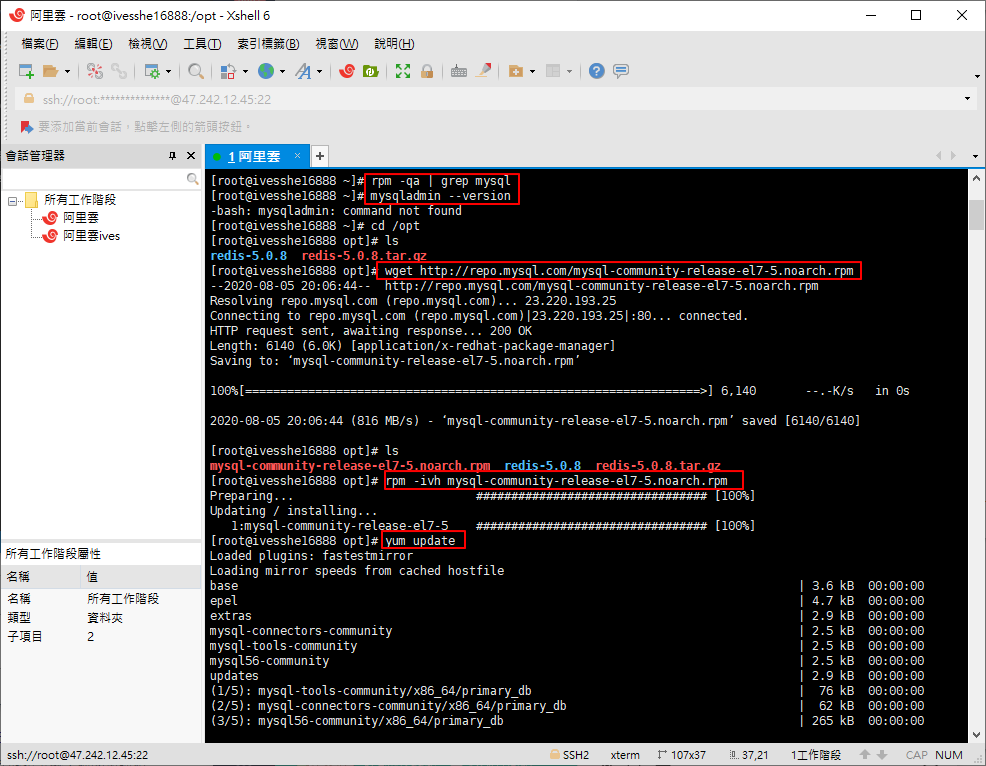

 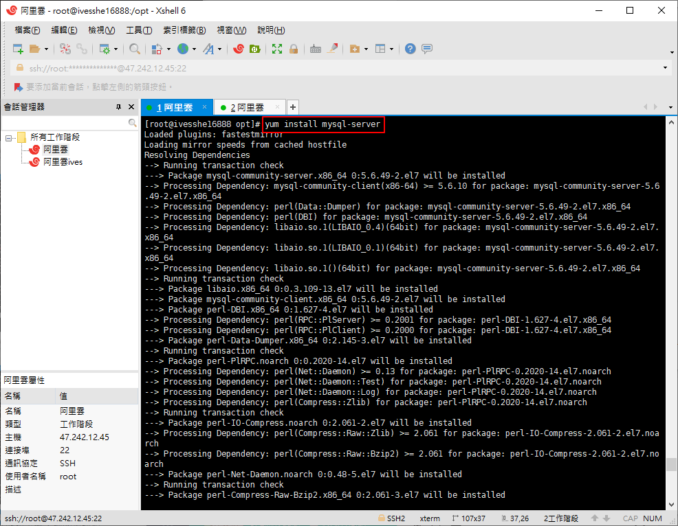

 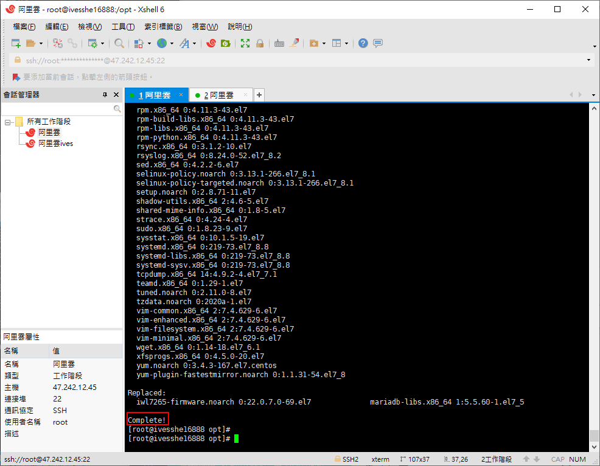

 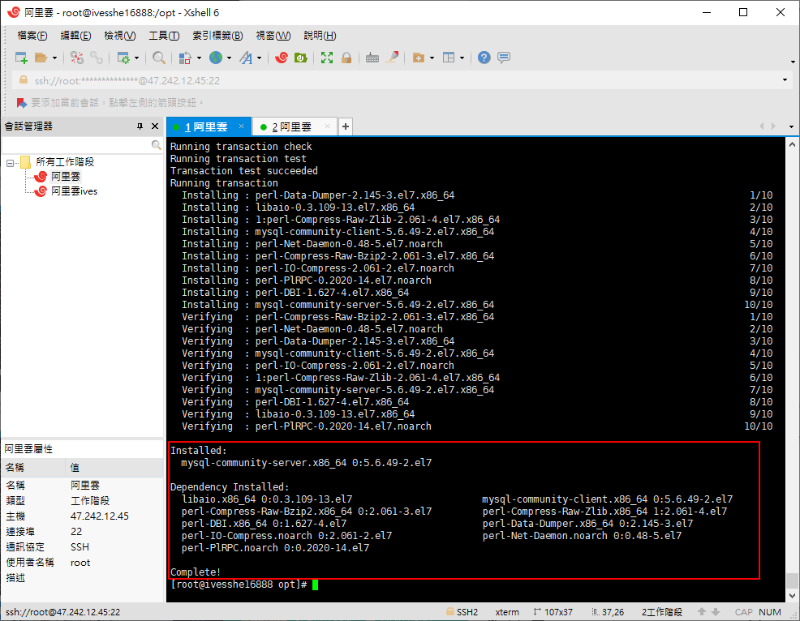

```shell
# 權限設值
chown mysql:mysql -R /var/lib/mysql
```
```shell
# 初始化MYSQL(但不知道為何報錯)
mysqld --initialize
```
```shell
# 啟動MYSQL
systemctl start mysqld
```
```shell
# 查看MYSQL運行狀態
systemctl status mysqld
```

  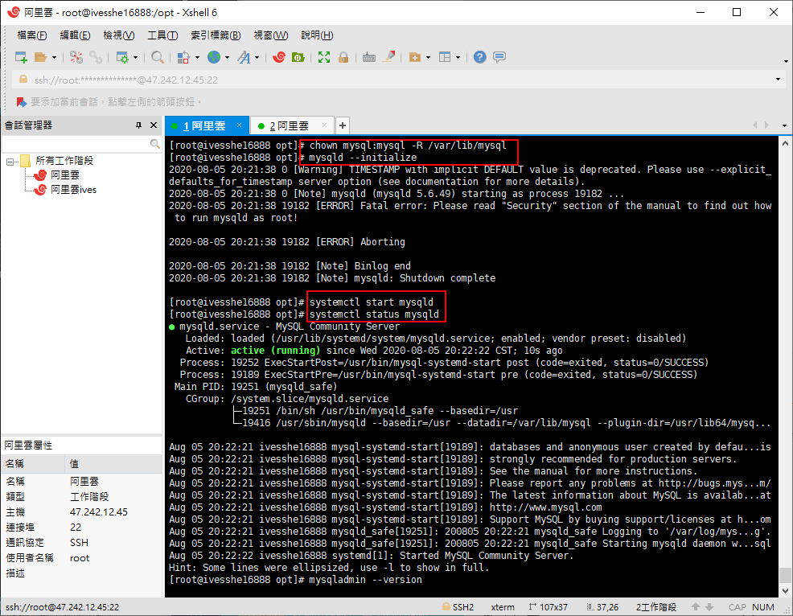

```shell
# 查看MYSQL版本
mysqladmin --version
```
  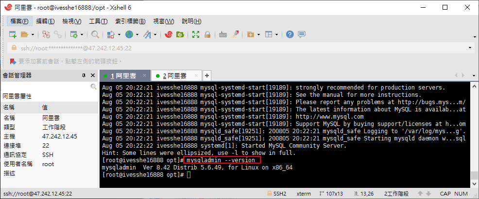

```shell
# 設置密碼(這邊好像有報錯誤)
mysqladmin -u root password "123456";
```
```shell
# 使用密碼登錄
-u root -p
```
  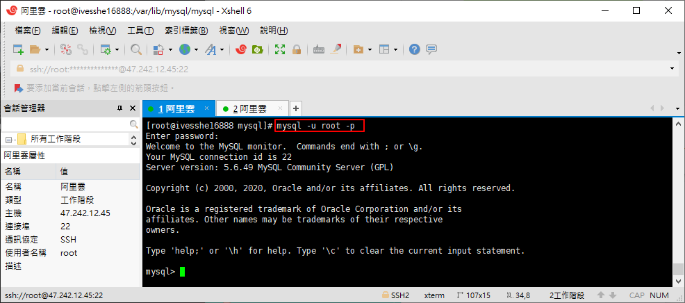

本來想使用SQLyog遠端連線阿里雲上的MYSQL，但報了錯誤，之後會先用Docker內的MYSQL作操作練習

 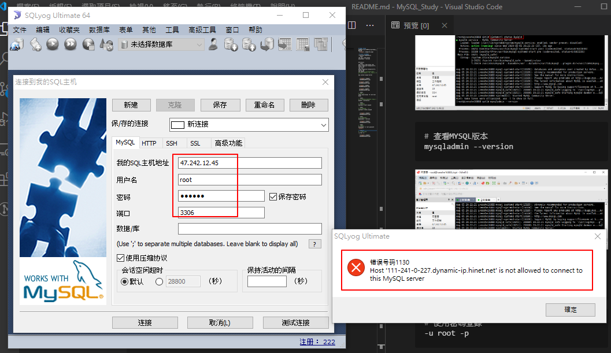

 看文意似乎是不允許中華電信動態ip的用戶連接，練習MYSQL先暫不處理這個問題
 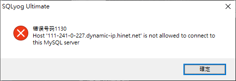

在docker建立mysql方便練習
 ```shell
docker run -d -p 3306:3306 -v /home/mysql/conf:/etc/mysql/conf.d -v /home/mysql/data:/var/lib/mysql -e MYSQL_ROOT_PASSWORD=123456 --name mysql_study mysql:5.7
 ```

  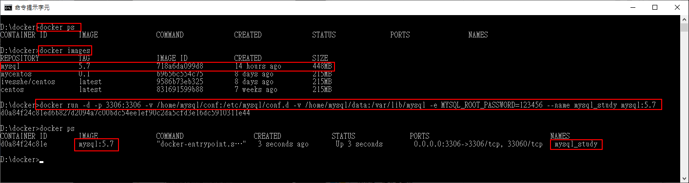

  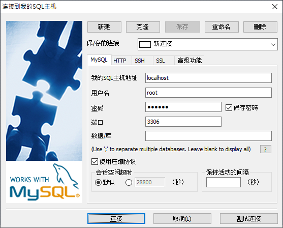

看到此畫面，代表連接成功
  


# Linux上卸載MYSQL
因為上一次安裝好，覺得有問題，這邊先卸載完，再重新安裝一次試試

[卸載參考網址](https://blog.csdn.net/HaHa_Sir/article/details/80552819)

[安裝參考網址](https://ithelp.ithome.com.tw/articles/10214666)

這次就不再製作過程了，之前run過一次，但這次換另一份文檔製作看看，是否會有問題

重新安裝好了，密碼的部分還是會報錯，傻眼了，所以上一次安裝可能是正確的，可能卡在mysql的root@localhot權限

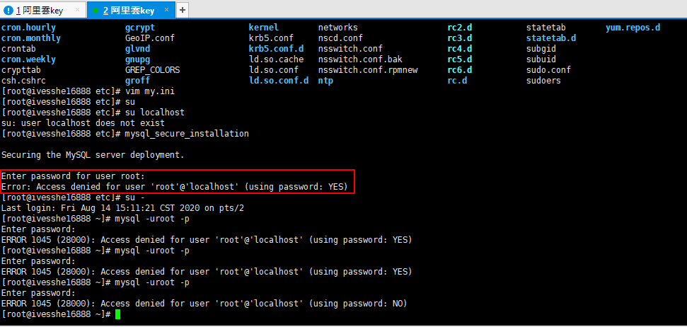

**結論： 阿里雲上安裝MySQL可能不讓人遠端連線吧? 暫時先跳過這邊了，先使用本地端練習吧**

# 使用虛擬機再戰一次

## 使用VMware pro 15安裝CentOS7

- 這邊有參考linux跟docker的筆記，筆記真的很重要，一些久久才作一次的事情，不記一下之後只能再重新google了
- CentOS7 裝好跟XShell設定好連線
- 安裝docker，在docker使用mysql 5.7的鏡像，不得不說docker真的很方便，不然自己裝mysql也要一點時間

連接成功了


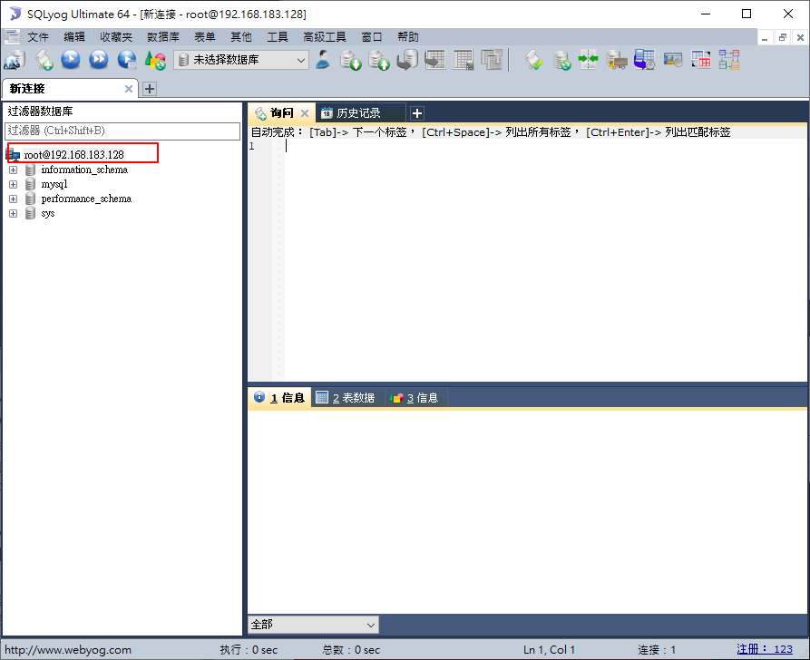