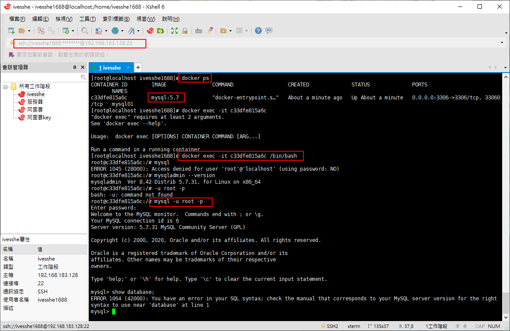

# MySQL Study
學習之後，製作成筆記，方便日後使用時復習
 

 # Linux 安裝MySQL
檢查系統上是否已經安裝
```shell
rpm -qa | grep mysql
mysqladmin --version
```

下載及安裝
```shell
wget http://repo.mysql.com/mysql-community-release-el7-5.noarch.rpm
rpm -ivh mysql-community-release-el7-5.noarch.rpm
yum update # 這邊會下載不少資料，要花點時間，中間也會詢問y or n
yum install mysql-server
```

  

 

 

 

```shell
# 權限設值
chown mysql:mysql -R /var/lib/mysql
```
```shell
# 初始化MYSQL(但不知道為何報錯)
mysqld --initialize
```
```shell
# 啟動MYSQL
systemctl start mysqld
```
```shell
# 查看MYSQL運行狀態
systemctl status mysqld
```

  

```shell
# 查看MYSQL版本
mysqladmin --version
```
  

```shell
# 設置密碼(這邊好像有報錯誤)
mysqladmin -u root password "123456";
```
```shell
# 使用密碼登錄
-u root -p
```
  

本來想使用SQLyog遠端連線阿里雲上的MYSQL，但報了錯誤，之後會先用Docker內的MYSQL作操作練習

 

 看文意似乎是不允許中華電信動態ip的用戶連接，練習MYSQL先暫不處理這個問題
 

在docker建立mysql方便練習
 ```shell
docker run -d -p 3306:3306 -v /home/mysql/conf:/etc/mysql/conf.d -v /home/mysql/data:/var/lib/mysql -e MYSQL_ROOT_PASSWORD=123456 --name mysql_study mysql:5.7
 ```

  

  

看到此畫面，代表連接成功
  


# Linux上卸載MYSQL
因為上一次安裝好，覺得有問題，這邊先卸載完，再重新安裝一次試試

[卸載參考網址](https://blog.csdn.net/HaHa_Sir/article/details/80552819)

[安裝參考網址](https://ithelp.ithome.com.tw/articles/10214666)

這次就不再製作過程了，之前run過一次，但這次換另一份文檔製作看看，是否會有問題

重新安裝好了，密碼的部分還是會報錯，傻眼了，所以上一次安裝可能是正確的，可能卡在mysql的root@localhot權限


**結論： 阿里雲上安裝MySQL可能不讓人遠端連線吧? 暫時先跳過這邊了，先使用本地端練習吧**

# 使用虛擬機再戰一次

## 使用VMware pro 15安裝CentOS7

- 這邊有參考linux跟docker的筆記，筆記真的很重要，一些久久才作一次的事情，不記一下之後只能再重新google了
- CentOS7 裝好跟XShell設定好連線
- 安裝docker，在docker使用mysql 5.7的鏡像，不得不說docker真的很方便，不然自己裝mysql也要一點時間

連接成功了




# 創建數據庫


# 創新一張表


# 連接數據庫

```sql
mysql -uroot -p
```


# 基本命令

```sql
show databases;   -- 查看所有的數據庫 
use school;       -- 切換school數據庫
show tables;      -- 查看數據庫中所有的表
describe student; -- 顯示數據庫中所有表的信息
```


```sql
-- 創建數據庫
create database westos; 

-- 退出連接
exit; 
```

```sql
CREATE DATABASE IF NOT EXISTS westos;

-- 刪除數據庫
DROP DATABASE IF EXISTS westos;

-- 刪除表
DROP TABLE IF EXISTS `student`;
```

```sql
-- 使用數據庫
USE `school`
```


```sql
-- 使用數據庫
SELECT `user` FROM student;
```

```sql
-- 查看數據庫
SHOW DATABASES;
```

# sqlyog 修改自增步長


# 創建一張表

```sql
CREATE TABLE IF NOT EXISTS `student`(
  `id` INT(4) NOT NULL AUTO_INCREMENT COMMENT '學號',
  `name` VARCHAR(30) NOT NULL DEFAULT '匿名' COMMENT '姓名',
  `pwd` VARCHAR(20) NOT NULL DEFAULT '123456' COMMENT '密碼',
  `sex` VARCHAR(20) NOT NULL DEFAULT '女' COMMENT '性別',
  `birthday` DATETIME DEFAULT NULL COMMENT '出生日期',
  `address` VARCHAR(100) DEFAULT NULL COMMENT '家庭住址',
  `email` VARCHAR(50) DEFAULT NULL COMMENT '郵箱',
  PRIMARY KEY(`id`)
)ENGINE=INNODB DEFAULT CHARSET=utf8
```


## 查看創建數據庫的語句

```sql
SHOW CREATE DATABASE school;
```

## 查看創建表的語句

```sql
SHOW CREATE TABLE student;
```

## 查看表的結構

```sql
DESC student;
```

# 數據表的類型

```
INNODB 默認使用
MYISAM 早些年使用
```

# 修改表名

```sql
ALTER TABLE student RENAME AS student1;
```

## 增加表的字段

```sql
ALTER TABLE student1 ADD test INT(11);
```
# 修改表的字段

修改約束

```sql
ALTER TABLE student1 MODIFY test VARCHAR(11);
```


# 字段重名及約束

```sql
ALTER TABLE student1 CHANGE test test1 INT(1);
```

# 刪除表的字段

```sql
ALTER TABLE student1 DROP test VARCHAR(11);
```

# 刪除表(如果表存在再刪除)

```sql
DROP TABLE IF EXISTS `student`;
```

**所有的創建和刪除操作，盡量加上判斷，避免報錯**

# 創建年級表 - 方法一 創建時增加外鍵關係

```sql
CREATE TABLE IF NOT EXISTS `grade`(
  `gradeid` INT(10) NOT NULL AUTO_INCREMENT COMMENT '年級id',
  `gradename` VARCHAR(50) NOT NULL COMMENT '年級名稱',
  PRIMARY KEY(`gradeid`)
)ENGINE=INNODB DEFAULT CHARSET=utf8
```

```sql
-- 學生表的gredeid字段，要去引用年級表的gradeid
-- 定義外鍵key
-- 給這個外鍵添加約束(執行引用) references引用
CREATE TABLE IF NOT EXISTS `student`(
  `id` INT(4) NOT NULL AUTO_INCREMENT COMMENT '學號',
  `name` VARCHAR(30) NOT NULL DEFAULT '匿名' COMMENT '姓名',
  `pwd` VARCHAR(20) NOT NULL DEFAULT '123456' COMMENT '密碼',
  `sex` VARCHAR(20) NOT NULL DEFAULT '女' COMMENT '性別',
  `birthday` DATETIME DEFAULT NULL COMMENT '出生日期',
  `gradeid` INT(10) NOT NULL COMMENT '學生的年級',
  `address` VARCHAR(100) DEFAULT NULL COMMENT '家庭住址',
  `email` VARCHAR(50) DEFAULT NULL COMMENT '郵箱',
  PRIMARY KEY(`id`),
  KEY `FK_gradeid` (`gradeid`),
  CONSTRAINT `FK_gradeid` FOREIGN KEY (`gradeid`) REFERENCES `grade` (`gradeid`)
)ENGINE=INNODB DEFAULT CHARSET=utf8
```

# 創建年級表 - 方法二 創建時沒有外鍵關係，建立表成功後，添加外鍵約束

```sql
CREATE TABLE IF NOT EXISTS `grade`(
  `gradeid` INT(10) NOT NULL AUTO_INCREMENT COMMENT '年級id',
  `gradename` VARCHAR(50) NOT NULL COMMENT '年級名稱',
  PRIMARY KEY(`gradeid`)
)ENGINE=INNODB DEFAULT CHARSET=utf8
```

```sql
CREATE TABLE IF NOT EXISTS `student`(
  `id` INT(4) NOT NULL AUTO_INCREMENT COMMENT '學號',
  `name` VARCHAR(30) NOT NULL DEFAULT '匿名' COMMENT '姓名',
  `pwd` VARCHAR(20) NOT NULL DEFAULT '123456' COMMENT '密碼',
  `sex` VARCHAR(20) NOT NULL DEFAULT '女' COMMENT '性別',
  `birthday` DATETIME DEFAULT NULL COMMENT '出生日期',
  `gradeid` INT(10) NOT NULL COMMENT '學生的年級',
  `address` VARCHAR(100) DEFAULT NULL COMMENT '家庭住址',
  `email` VARCHAR(50) DEFAULT NULL COMMENT '郵箱',
  PRIMARY KEY(`id`)  
)ENGINE=INNODB DEFAULT CHARSET=utf8
```

```sql
ALTER TABLE `student` ADD CONSTRAINT `FK_gradeid` FOREIGN KEY(`gradeid`) REFERENCES `grade`(`gradeid`);
```

# 以上的操作都是物理外鍵，數據庫級別的外鍵，我們不建議使用(避免數據庫過多造成困擾，這裡了解即可)

> 最佳實踐

- 數據庫就是單純的表，只用來存數據，只有行(數據)和列(字段)
- 我們想使用多張表的數據，想使用外鍵(程序去實現)

# 插入語句

- 字段和字段之間使用英文逗號隔開
- 字段是可以省略的，但是後面的值必須要一一對應，不能少
- 可以同時插入多條數據，values後面的值，需要使用,隔開即可 (),(),()

插入單筆
```sql
INSERT INTO `grade`(`gradename`) VALUES('大四');
```

插入多筆
```sql
INSERT INTO `grade`(`gradename`) VALUES ('大二'),('大一');
```

```sql
INSERT INTO `student`(`name`,`pwd`,`sex`,`gradeid`) VALUES ('張三','aaaaa','男','1111');
```


```sql
INSERT INTO `student` VALUES (8,'ives','aaaaa','男','2000-01-01',5,'台北','email');
```

# 修改數據

修改學員的姓名，帶了條件
```sql
UPDATE `student` SET `name`='chichi' WHERE id=1;
```

不指定條件的情況下，會改動表中所有的數值
```sql
UPDATE `student` SET `name`='chichi';
```

```sql
UPDATE `student` SET `name`='ivesshe',`email`='ivesshe@gmail.com' WHERE id=1;
```

# 刪除

> delete命令

```sql
-- 避免這樣寫，會全部刪除
DELETE FROM `student`;

-- 刪除指定數據
DELETE FROM `student` WHERE id=8;
```

> TRUNCATE命令

作用: 完全清空一個數據庫表，表的結構和索引約束不會變!

```sql
TRUNCATE TABLE `student`
```

- TRUNCATE 重新設置，自增列 計數器會歸0
- TRUNCATE 不會影響事務

測試TRUNCATE與DELETE的區別

```sql
CREATE TABLE `test`(
  `id` INT(4) NOT NULL AUTO_INCREMENT,
  `coll` VARCHAR(20) NOT NULL,
  PRIMARY KEY(`id`)
)ENGINE=INNODB DEFAULT CHARSET=utf8

INSERT INTO `test`(`coll`) VALUES ('1'),('22'),('333');

DELETE FROM `test`; -- 不會影響自增

INSERT INTO `test`(`coll`) VALUES ('1'),('22'),('333');

TRUNCATE TABLE `test`; -- 自增會歸0

INSERT INTO `test`(`coll`) VALUES ('1'),('22'),('333');
```

# 查詢

school.sql
```sql
CREATE DATABASE IF NOT EXISTS `school`;

-- 創建一個school數據庫
USE `school`;-- 創建學生表
DROP TABLE IF EXISTS `student`;
CREATE TABLE `student`(
	`studentno` INT(4) NOT NULL COMMENT '學號',
	`loginpwd` VARCHAR(20) DEFAULT NULL,
	`studentname` VARCHAR(20) DEFAULT NULL COMMENT '學生姓名',
	`sex` TINYINT(1) DEFAULT NULL COMMENT '性別，0或1',
	`gradeid` INT(11) DEFAULT NULL COMMENT '年級編號',
	`phone` VARCHAR(50) NOT NULL COMMENT '聯系電話，允許為空',
	`address` VARCHAR(255) NOT NULL COMMENT '地址，允許為空',
	`borndate` DATETIME DEFAULT NULL COMMENT '出生時間',
	`email` VARCHAR (50) NOT NULL COMMENT '郵箱賬號允許為空',
	`identitycard` VARCHAR(18) DEFAULT NULL COMMENT '身份證號',
	PRIMARY KEY (`studentno`),
	UNIQUE KEY `identitycard`(`identitycard`),
	KEY `email` (`email`)
)ENGINE=MYISAM DEFAULT CHARSET=utf8;

-- 插入學生數據 其余自行添加 這里只添加了2行
INSERT INTO `student` (`studentno`,`loginpwd`,`studentname`,`sex`,`gradeid`,`phone`,`address`,`borndate`,`email`,`identitycard`)
VALUES
(1000,'123456','張偉',0,2,'13800001234','北京朝陽','1980-1-1','text123@qq.com','123456198001011234'),
(1001,'123456','趙強',1,3,'13800002222','廣東深圳','1990-1-1','text111@qq.com','123456199001011233');

-- 創建科目表
DROP TABLE IF EXISTS `subject`;
CREATE TABLE `subject`(
	`subjectno`INT(11) NOT NULL AUTO_INCREMENT COMMENT '課程編號',
    `subjectname` VARCHAR(50) DEFAULT NULL COMMENT '課程名稱',
    `classhour` INT(4) DEFAULT NULL COMMENT '學時',
    `gradeid` INT(4) DEFAULT NULL COMMENT '年級編號',
    PRIMARY KEY (`subjectno`)
)ENGINE = INNODB AUTO_INCREMENT = 19 DEFAULT CHARSET = utf8;

-- 插入科目數據
INSERT INTO `subject`(`subjectno`,`subjectname`,`classhour`,`gradeid`)VALUES
(1,'高等數學-1',110,1),
(2,'高等數學-2',110,2),
(3,'高等數學-3',100,3),
(4,'高等數學-4',130,4),
(5,'C語言-1',110,1),
(6,'C語言-2',110,2),
(7,'C語言-3',100,3),
(8,'C語言-4',130,4),
(9,'Java程序設計-1',110,1),
(10,'Java程序設計-2',110,2),
(11,'Java程序設計-3',100,3),
(12,'Java程序設計-4',130,4),
(13,'數據庫結構-1',110,1),
(14,'數據庫結構-2',110,2),
(15,'數據庫結構-3',100,3),
(16,'數據庫結構-4',130,4),
(17,'C#基礎',130,1);

-- 創建成績表
drop table if exists `result`;
create table `result`(
	`studentno` int(4) not null comment '學號',
    `subjectno` int(4) not null comment '課程編號',
    `examdate` datetime not null comment '考試日期',
    `studentresult` int (4) not null comment '考試成績',
    key `subjectno` (`subjectno`)
)engine = innodb default charset = utf8;

-- 插入成績數據  這里僅插入了一組，其余自行添加
insert into `result`(`studentno`,`subjectno`,`examdate`,`studentresult`)
values
(1000,1,'2013-11-11 16:00:00',85),
(1000,2,'2013-11-12 16:00:00',70),
(1000,3,'2013-11-11 09:00:00',68),
(1000,4,'2013-11-13 16:00:00',98),
(1000,5,'2013-11-14 16:00:00',58);

-- 創建年級表
drop table if exists `grade`;
create table `grade`(
	`gradeid` int(11) not null auto_increment comment '年級編號',
  `gradename` varchar(50) not null comment '年級名稱',
    primary key (`gradeid`)
) engine=innodb auto_increment = 6 default charset = utf8;

-- 插入年級數據
insert into `grade` (`gradeid`,`gradename`) values(1,'大一'),(2,'大二'),(3,'大三'),(4,'大四'),(5,'預科班');
```

```sql
-- 查詢所有的學生
SELECT * FROM student;

-- 查詢所有的學生
SELECT * FROM result;

-- 查詢指定字段
SELECT `studentno`,`studentname` FROM student;

-- 查詢指定字段，給結果起一個名字 AS (也可以給表取別名)
SELECT `studentno` AS 學號,`studentname` AS 學生姓名 FROM student;

-- 函數 Concat(a,b)
SELECT CONCAT('姓名： ',`studentname`) AS 新名字 FROM student;
```

> 去重 DISTINCT

去除SELECT查詢出來的結果中重複的數據，重複的數據只顯示一條

```sql
-- 查詢一下有哪些同學參加了考試，成績
SELECT * FROM result; -- 查詢全部的考試成績

-- 查詢有哪些同學參加考試
SELECT `studentno` FROM result;

-- 發現重複數據，去重
SELECT DISTINCT `studentno` FROM result;
```

> 數據庫的列(表達式)

```sql
SELECT VERSION();	-- 查詢系統版本
SELECT 100*3-1 AS 計算結果;	-- 用來計算
SELECT	@@auto_increment_increment; -- 查詢自增的步長
-- 學員考試成績+1分查看
SELECT `studentno`,`studentresult`+1 AS '提分後' FROM result;
```

# where條件字句

```sql
SELECT `studentno`,`studentresult` FROM result;
```

```sql
-- 查詢考試成績在95-100分之間
SELECT `studentno`,`studentresult` FROM result WHERE `studentresult` >= 90 AND  `studentresult` <= 100;
```

```sql
-- 模糊查詢(區間)
SELECT `studentno`,`studentresult` FROM result WHERE `studentresult` BETWEEN 80 AND 100;
```

```sql
-- 除了1001號學生之外同學的成績
SELECT `studentno`,`studentresult` FROM result WHERE `studentno` != 1001 ;

SELECT `studentno`,`studentresult` FROM result WHERE NOT `studentno` = 1000 ;
```

> 模糊查詢：比較運算符

```sql
-- 查詢姓张的同學
-- like結合%(代表0到任意個字符) (一個字符)
SELECT `studentno`,`studentname` FROM `student` WHERE `studentname` LIKE '张%';

-- 查詢姓张的同學，名字後面只有一個字的
SELECT `studentno`,`studentname` FROM `student` WHERE `studentname` LIKE '张_';

-- 查詢 1000,1001,1002號學員
SELECT `studentno`,`studentname` FROM `student` WHERE `studentno` IN (1000,1001,1002);
```

```sql
-- (具體的一個或者多個值，不能使用% _)
-- 查詢 住在 北京朝阳 的學生
SELECT `studentno`,`studentname`,`address` FROM `student` WHERE `address` IN ('北京朝阳');

-- 查詢地址為空的學生
SELECT `studentno`,`studentname`,`address` FROM `student` WHERE `address` ='' OR `address` IS NULL;
```

```sql
-- 聯表查詢

-- 查詢參加了考試的同學(學號、姓名、科目編號，分數)
/*
  思路
  1. 分析需求，分析查詢的字段來自哪些表(連接查詢)
  2. 確定使用哪種連接查詢(有7種)
  確定交叉點(這兩個表中哪個數據是相同的)
  判斷的條件：學生表中的 studentno = 成績表 studentno  

  左表 leftjoin
  交叉處 innerjoin
  右表 rightjoin
*/

-- INNER JOIN
-- 如果表中至少有一個匹配，就返回行
SELECT s.`studentno`,`studentname`,`subjectno`,`studentresult` 
FROM `student` AS s
INNER JOIN `result` AS r
WHERE s.`studentno` = r.`studentno`;


-- RIGHT JOIN
-- 會從右表中返回所有的值，即使左表中沒有匹配
SELECT s.`studentno`,`studentname`,`subjectno`,`studentresult` 
FROM `student` s
RIGHT JOIN `result` r
ON s.`studentno` = r.`studentno`;


-- LEFT JOIN
-- 會從左表中返回所有的值，即使右表中沒有匹配
SELECT s.`studentno`,`studentname`,`subjectno`,`studentresult` 
FROM `student` s
LEFT JOIN `result` r
ON s.`studentno` = r.`studentno`;

-- 查詢缺考的同學
SELECT s.`studentno`,`studentname`,`subjectno`,`studentresult` 
FROM `student` s
LEFT JOIN `result` r
ON s.`studentno` = r.`studentno`
WHERE `studentresult` IS NULL;

-- join (連接的表) on (判斷的條件) 連接查詢
-- where 等值查詢
```

```sql

-- 思考題(查詢參加考試的同學信息：學號、學生姓名、科目名，分數)

/* 
  思路
  1. 分析需求，分析查詢的字段來自哪些表(連接查詢)，student、result、subject(連接查詢)
  2. 確定使用哪種連接查詢(有7種)
  確定交叉點(這兩個表中哪個數據是相同的)
  判斷的條件：學生表中的 studentno = 成績表 studentno
*/

SELECT s.`studentno`,`studentname`,`subjectname`,`studentresult`
FROM `student` s
RIGHT JOIN `result` r
ON r.`studentno` = s.`studentno`
INNER JOIN `subject` sub
ON r.`subjectno` = sub.`subjectno`;
```

```sql
-- 我要查詢哪些數據 select ...
-- 從哪幾種表查 from 表 xxx join 連接的表 on 交叉條件
-- 假設存在一種多張表查詢，先查詢兩張表然後再慢慢增加
```

> 自連接

自己的表和自己的表連接，核心：一張表拆為兩張一樣的表即可

建表
```sql
CREATE TABLE `school`.`category`( `categoryid` INT(3) NOT NULL COMMENT '主題id', `pid` INT(3) NOT NULL COMMENT '父id 没有父则为1', `categoryname` VARCHAR(10) NOT NULL COMMENT '种类名字', PRIMARY KEY (`categoryid`) ) ENGINE=INNODB CHARSET=utf8 COLLATE=utf8_general_ci;
```

新增資料
```sql
INSERT INTO `school`.`category` (`categoryid`, `pid`, `categoryname`) VALUES ('2', '1', '信息技术');
INSERT INTO `school`.`category` (`categoryid`, `pid`, `categoryname`) VALUES ('3', '1', '软件开发');
INSERT INTO `school`.`category` (`categoryid`, `PId`, `categoryname`) VALUES ('5', '1', '美术设计');
INSERT INTO `school`.`category` (`categoryid`, `pid`, `categorynamE`) VALUES ('4', '3', '数据库');
INSERT INTO `school`.`category` (`categoryid`, `pid`, `categoryname`) VALUES ('8', '2', '办公信息');
INSERT INTO `school`.`category` (`categoryid`, `pid`, `CAtegoryname`) VALUES ('6', '3', 'web开发');
INSERT INTO `school`.`category` (`categoryid`, `pid`, `categoryname`) VALUES ('7', '5', 'ps技术');
```

```sql
-- 查詢父子信息
SELECT a.`categoryname` AS '父欄目',b.`categoryname` AS '子欄目'
FROM `category` AS a,`category` AS b
WHERE a.`categoryid` = b.`pid`;
```

```sql
-- 查詢學員所屬的年級(學號、學生的姓名、年級名稱)
SELECT `studentno`,`studentname`,`gradename`
FROM `student` s
INNER JOIN `grade` g
ON s.`gradeid` = g.`gradeid`;
```

```sql
-- 查詢科目所屬的年級(科目名稱、年級名稱)
SELECT `subjectname`,`gradename`
FROM `subject` sub
INNER JOIN `grade` g
ON sub.`gradeid` = g.`gradeid`;
```

```sql
-- 查詢 高等数学-1 考試同學信息：學號、學生的姓名、科目名、分數
SELECT s.`studentno`,`studentname`,`subjectname`,`studentresult`
FROM `student` s
INNER JOIN `result` r
ON s.`studentno` = r.`studentno`
INNER JOIN `subject` sub
ON r.`subjectno` = sub.`subjectno`
WHERE `subjectname` = '高等数学-1';
```

# 分頁和排序

降序排序
```sql
SELECT s.`studentno`,`studentname`,`subjectname`,`studentresult`
FROM `student` s
INNER JOIN `result` r
ON s.`studentno` = r.`studentno`
INNER JOIN `subject` sub
ON r.`subjectno` = sub.`subjectno`
ORDER BY `studentresult` DESC;
```

升序排序
```sql
SELECT s.`studentno`,`studentname`,`subjectname`,`studentresult`
FROM `student` s
INNER JOIN `result` r
ON s.`studentno` = r.`studentno`
INNER JOIN `subject` sub
ON r.`subjectno` = sub.`subjectno`
ORDER BY `studentresult` ASC;
```

> 為什麼要分頁

緩解數據庫的壓力，給人的體驗更好，瀑布流

分頁，分頁只顯示2條數據
```sql
-- 語法： limit 起始值，頁面的大小
SELECT s.`studentno`,`studentname`,`subjectname`,`studentresult`
FROM `student` s
INNER JOIN `result` r
ON s.`studentno` = r.`studentno`
INNER JOIN `subject` sub
ON r.`subjectno` = sub.`subjectno`
ORDER BY `studentresult` ASC;
```

```sql
-- 第1頁 limit 0,5 
-- 第2頁 limit 5,5 
-- 第3頁 limit 10,5 
-- 第n頁 limit (n-1)*pageSize,pageSize 
-- 數據總數/頁面大小 = 總頁數
```

```sql
-- 思考
-- 查詢 高等数学第一學年 課程成績排名前十的學生，並且分數要大於80的學生信息(學號、姓名，課程名稱，分數)

SELECT s.`studentno`,`studentname`,`subjectname`,`studentresult`
FROM `student` s
INNER JOIN `result` r
ON s.`studentno` = r.`studentno`
INNER JOIN `subject` sub
ON sub.`subjectno` = r.`subjectno`
WHERE `subjectname` = '高等数学-1' AND `studentresult` >= 80
ORDER BY `studentresult` DESC;
```

# 子查詢

```sql
-- 查詢 高等数学-1 的所有考試結果(學號，科目編號，成績)，降序排列
-- 方式一：使用連接查詢
SELECT `studentno`,`subjectname`,`studentresult`
FROM `result` r
INNER JOIN `subject` sub
ON r.`subjectno` = sub.`subjectno`
WHERE `subjectname` = '高等数学-1';
```

```sql
-- 方式二：使用子查詢
SELECT `studentno`,`subjectno`,`studentresult`
FROM `result` r
WHERE `subjectno` = (
 
)

-- 查詢所有 高等数学-1 的學生學號
SELECT `subjectno` FROM `subject` WHERE `subjectname` = '高等数学-1';


-- 上面兩者合併
SELECT `studentno`,`subjectno`,`studentresult`
FROM `result` r
WHERE `subjectno` = (
  SELECT `subjectno` FROM `subject` WHERE `subjectname` = '高等数学-1'
)
ORDER BY `studentresult` DESC;
```

```sql
-- 在這個基礎上增加一個科目，高等数学-1
SELECT DISTINCT s.`studentno`,`studentname`,`studentresult`
FROM `student` s
INNER JOIN `result` r
ON r.`studentno` = s.`studentno`
WHERE `studentresult` >= 0 AND `subjectno` = (
  SELECT `subjectno` FROM `subject` WHERE `subjectname` = '高等数学-1'
);
```

# MySQL函數

```sql
-- 絕對值
SELECT ABS(-8); 

-- 向上取整
SELECT CEILING(9.4); 

-- 向下取整
SELECT FLOOR(9.4); 

-- 返回一個0-1之間的隨機數
SELECT RAND();

-- 判斷一個數的符號，負數返回-1，正數返回1
SELECT SIGN(-10);
```

```sql
-- 字符串函數
-- 字符串長度
SELECT CHAR_LENGTH('即使再小的帆，也能遠航');

-- 拼接字符串
SELECT CONCAT('我','愛','Golang');

-- 查詢、替換(從某個位置開始替換某個長度)
SELECT INSERT('我愛編程',1,2,'超級熱愛');

-- 小寫字母
SELECT LOWER('IvesShe');

-- 大寫字母
SELECT UPPER('IvesShe');

-- 返回第一次出現該子串的索引
SELECT INSTR('ivesshe','e');

-- 替換出現的指定字符串
SELECT REPLACE('我說堅持就能成功','堅持','努力');

-- 返回指定的子字符串(源字符串，截取的位置，截取的長度)
SELECT SUBSTR('我說堅持就能成功',5,2);

-- 反轉
SELECT REVERSE('我說堅持就能成功');
```

```sql
-- 查詢姓张的同字，改成王
SELECT REPLACE(`studentname`,'张','王') FROM `student`
WHERE `studentname` LIKE '张%';

-- 時間和日期函數
-- 獲取當前日期
SELECT CURRENT_DATE();
SELECT CURDATE();

-- 本地時間
SELECT LOCALTIME();

-- 系統時間
SELECT SYSDATE();

SELECT YEAR(NOW());
SELECT MONTH(NOW());
SELECT DAY(NOW());
SELECT HOUR(NOW());
SELECT MINUTE(NOW());
SELECT SECOND(NOW());

-- 系統
SELECT SYSTEM_USER();
SELECT USER();
SELECT VERSION();

```

# 聚合函數

```sql
-- 都能夠統計 表中的數據
-- count(字段)，會忽略所有的null值
SELECT COUNT(`studentname`) FROM `student`;

-- 不會忽略null值
SELECT COUNT(*) FROM `student`;
SELECT COUNT(1) FROM `result`;
```

```sql
SELECT SUM(`studentresult`) AS 總和 FROM result;
SELECT AVG(`studentresult`) AS 平均分 FROM result;
SELECT MAX(`studentresult`) AS 最高分 FROM result;
SELECT MIN(`studentresult`) AS 最低分 FROM result;
```


```sql
-- 查詢不同課程的平均分，最高分，最低分，平均分>=80 (有問題)
SELECT `subjectname`,AVG(`studentresult`)AS 平均分,MAX(`studentresult`),MIN(`studentresult`)
FROM `result` r
INNER JOIN `subject` sub
ON r.`subjectno` = sub.`subjectno`
GROUP BY R.`subjectno` -- 通過什麼字段來分組
HAVING 平均分 >= 80;
```

# 測試MD5加密

```sql
-- 測試MD5加密
CREATE TABLE `testmd5`(
  `id` INT(4) NOT NULL,
  `name` VARCHAR(50) NOT NULL,
  `pwd` VARCHAR(50) NOT NULL,
  PRIMARY KEY(`id`)
)ENGINE=INNODB DEFAULT CHARSET=utf8;
```

```sql
-- 明文密碼
INSERT INTO `school`.`testmd5` (`id`, `name`, `pwd`) VALUES ('1', 'ivesshe', '123456'); 
INSERT INTO `school`.`testmd5` (`id`, `name`, `pwd`) VALUES ('2', 'chichi', '123456'); 
INSERT INTO `school`.`testmd5` (`id`, `name`, `pwd`) VALUES ('3', 'jolin', '123456'); 

-- 加密
UPDATE testmd5 SET pwd=MD5(pwd) WHERE id=1;

-- 加密全部的密碼
UPDATE testmd5 SET pwd=MD5(pwd);

-- 插入的時候加密
INSERT INTO `school`.`testmd5` (`id`, `name`, `pwd`) VALUES ('4', 'joyce', MD5('123456')); 

-- 如何校驗：將用戶傳遞進來的密碼，進行md5加密，然後比對加密後的值
SELECT * FROM testmd5 WHERE `name` = 'joyce' AND pwd=MD5('123456');
```

# 事務管理 ACID

- 原子性(Atomicity)
```
一起成功，或一起失敗
```
- 一致性(Consistency)
```
針對事務操作前與操作後的狀態一致
```
- 隔離性(Lsolation)
```
針對多個用戶同時操作，主要是排除其它事務對本次事務的影響
```
- 持久性(Durability)
```
事務一旦提交則不可逆，結束後的數據不隨著外界原因導致數據丟失
```

> 隔離所導致的一些問題

- 髒讀
```
指一個事務讀取了另一個事務未提交的數據
```
- 不可重複讀
```
在一個事務內讀取表中的某一行數據，多次讀取結果不同。(這個不一定是錯誤，只是某些場合不對)
```
- 虛讀(幻讀)
```
是指在一個事務內讀取到了別的事務插入的數據，導致前後讀取不一致。
```

```sql
-- mysql 是默認開啟事務自動提交
set autocommit = 0 -- 關閉
set autocommit = 1 -- 開啟(默認的)

-- 手動處理事務
set autocommit = 0 -- 關閉自動提交

-- 事務開啟
start transaction -- 標記一個事務的開始，從這個之後的sql都在同一個事務內

insert xx
insert xx

-- 提交：持久化(成功!)
commit
-- 回滾：回到原來的樣子(失敗!)
rollback

-- 事務結束
set autocommit = 1 -- 設置一個事務的保存點
rollback to savepoint 保存點名 -- 回滾到保存點
release savepoint 保存點名 -- 撤銷保存點


-- 事務結束

```

> 轉帳

```sql
-- 轉帳
CREATE DATABASE shop CHARACTER SET utf8 COLLATE utf8_general_ci;

USE shop;

CREATE TABLE `account`(
  `id` INT(3) NOT NULL AUTO_INCREMENT,
  `name` VARCHAR(30) NOT NULL,
  `money` DECIMAL(9,2) NOT NULL,
  PRIMARY KEY (`id`)
)ENGINE=INNODB DEFAULT CHARSET=utf8;
```

```sql
-- 模擬轉帳：事務
SET autocommit = 0; -- 關閉自動提交
START TRANSACTION; -- 開啟一個事務(一組事務)

UPDATE account SET money=money-500 WHERE `name` = 'A'; -- A減500
UPDATE account SET money=money+500 WHERE `name` = 'B'; -- B加500

COMMIT; -- 提交事務，就被持久化了
-- ROLLBACK; -- 回滾

SET autocommit = 1; -- 恢復默認值 
```

# 索引

索引的引用

1. 在創建表的時候給字段增加索引
2. 創建完畢後，增加索引

```sql
-- 顯示所有的索引信息
SHOW INDEX FROM student;

-- 增加一個全文索引 (索引名) 列名
ALTER TABLE school.student ADD FULLTEXT INDEX `studentName`(`studentName`);

-- explain 分析sql執行的狀況
EXPLAIN SELECT * FROM student; -- 非全文索引

EXPLAIN SELECT * FROM student WHERE MATCH(studentName) AGAINST('劉');
```

# 100萬條數據

建表
```sql
CREATE TABLE `app_user` (
`id` bigint(20) unsigned NOT NULL AUTO_INCREMENT,
`name` varchar(50) DEFAULT '',
`eamil` varchar(50) NOT NULL,
`phone` varchar(20) DEFAULT '',
`gender` tinyint(4) unsigned DEFAULT '0',
`password` varchar(100) NOT NULL DEFAULT '',
`age` tinyint(4) DEFAULT NULL,
`create_time` datetime DEFAULT CURRENT_TIMESTAMP,
`update_time` timestamp NOT NULL DEFAULT CURRENT_TIMESTAMP ON UPDATE CURRENT_TIMESTAMP,
PRIMARY KEY (`id`)
) ENGINE=InnoDB DEFAULT CHARSET=utf8;
```

```sql

-- 這邊測試不成功

-- 插入100萬條數據
DROP FUNCTION IF EXISTS mock_data;
-- 写函数之前必须要写，标志:$$
DELIMITER $$
CREATE FUNCTION mock_data()
RETURNS INT
-- 注意returns，否则报错。
BEGIN
  DECLARE num INT DEFAULT 1000000;
  -- num 作为截止数字，定义为百万，
  DECLARE i INT DEFAULT 0;
  WHILE i < num DO
    INSERT INTO app_user(`name`, `email`, `phone`, `gender`, `password`, `age`) VALUES(CONCAT('用户', i), CONCAT('100',i,'@qq.com'), CONCAT('13', FLOOR(RAND()*(999999999-100000000)+100000000)),FLOOR(RAND()*2),UUID(), FLOOR(RAND()*100));
    SET i = i + 1;
  END WHILE;
  RETURN i;
END;

SELECT mock_data(); -- 執行此函數，生成一百萬條數據
```

